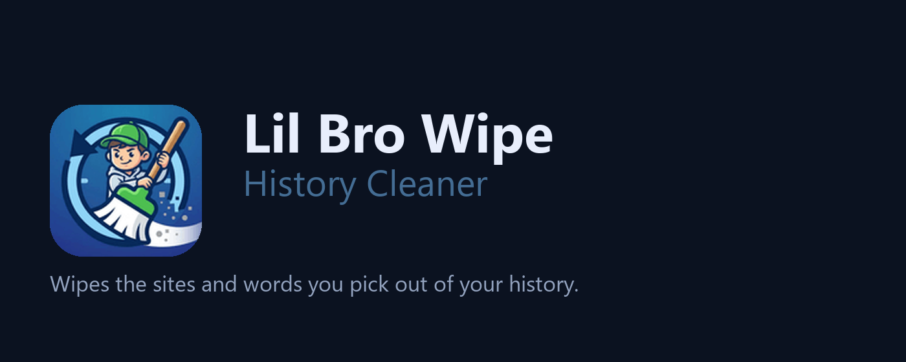

# Lil Bro Wipe – History Cleaner

Keeps the sites and words you choose out of your browsing history, in any Chromium browser. No
account, no server, nothing sent anywhere.

You give it a list: a site, a word, one page, a pattern. It takes the matching entries out of your
history while you browse, or at the start of your next session, without you thinking about it. Open
the popup on any page and it tells you straight away whether that page is on the list.

Cache, cookies, the download list and typed form text sit behind four presets, off until you switch
one on. A PIN hides the list from anyone else using the same computer, and a keep list covers the
sites you never want touched.

## Install

Or by hand:

1. Open `chrome://extensions` and turn on Developer mode
2. Choose **Load unpacked** and pick this folder
3. Pin the icon, then open **All settings**

## Limits

- Passwords are not touched. The browser removed that for extensions, so there is no switch for it.
- The browser cannot narrow history, downloads or form text to one site, so those go for the span
  you chose, not per site.
- The browser will not run anything at the exact moment it closes, so a clean set for close happens
  at your next start instead.
- A deleted address can still appear in the address bar suggestions.
- Cookies go for the whole site, so you are signed out there afterwards.
- Everything you add, the list included, stays on this computer. It does not follow you to your
  other machines, and there is no account to sign in to.

## Support

Like my work?

Something broken, or a site you want covered?

## Privacy

Everything ships inside the package: no remote code, no analytics, no network requests of its own.
The one link out is the support page, and your browser opens it in a new tab only if you click it.
The long version is [the policy](https://forsigh.github.io/lil-bro-history-wipe/privacy.html).

Permissions: `history` (the only one that shows a warning), `storage`, `notifications`,
`contextMenus`, `activeTab`, `browsingData`, `cookies`. `tabs` is optional and asked for only by the
cookie-on-tab-close setting. No host permissions, no content scripts.
